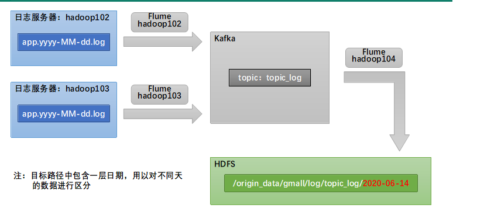

## 用户行为日志采集

### 数据采集通道


### Flume配置
- file_to_kafka.conf
> 采集日志数据到kafka
```conf
#为各组件命名
a1.sources = r1
a1.channels = c1

#描述source
a1.sources.r1.type = TAILDIR
a1.sources.r1.filegroups = f1
a1.sources.r1.filegroups.f1 = /opt/module/applog/log/app.*
a1.sources.r1.positionFile = /opt/module/applog/taildir_position.json
a1.sources.r1.interceptors =  i1
a1.sources.r1.interceptors.i1.type = com.flume.interceptor.LogInterceptor$Builder

#描述channel
a1.channels.c1.type = org.apache.flume.channel.kafka.KafkaChannel
a1.channels.c1.kafka.bootstrap.servers = hadoop100:9092,hadoop101:9092,hadoop102:9092
a1.channels.c1.kafka.topic = topic_log
a1.channels.c1.parseAsFlumeEvent = false

#绑定source和channel以及sink和channel的关系
a1.sources.r1.channels = c1
```
